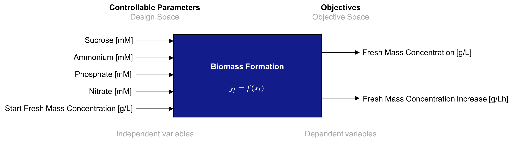
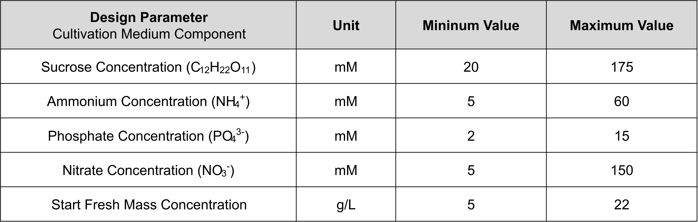
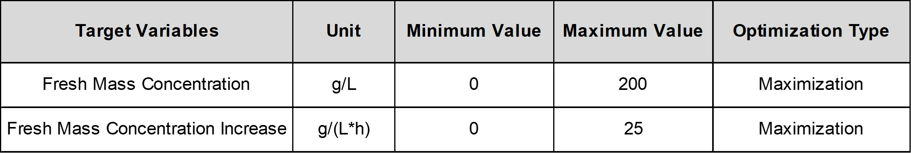
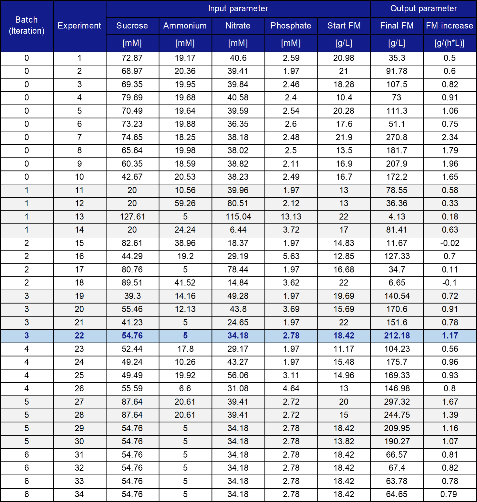

# Bayesian experimental design for the optimization of medium composition and biomass formation of tobacco BY-2 cell suspension cultures in a stirred-tank bioreactor  

---

## 1. Motivation
Utilizing multi-variate, multi-objective, and batch Bayesian Experimental Design for optimizing medium composition and biomass formation in the batch-phase of tobacco BY-2 cell suspension cultures in a stirred-tank bioreactor.

#### Typical cultivation process of BY-2 cells consisting of an initial one-week batch phase followed by a multi-week semi-continuous phase


#### Process scheme with input parameters (independent variables) and objectives (dependent variables) for the biomass formation in a batch fermentation process of BY-2 cells.



#### Overview of controllable parameters (design space) for biomass formation in a batch fermentation process of BY-2 cells



#### Overview of objectives (objective space) for biomass formation in a batch fermentation process of BY-2 cells


---

## 2. Installation Instructions

### Requirements

- **Python 3.12** or newer 
- **Numpy** numpy==1.26.4
- **Pandas** pandas==2.2.2
- **BoTorch** botorch==0.12.0
- **Ax** ax-platform==0.4.3
- **Torch** torch==2.4.1

### Steps

```bash
# Clone the repository
git clone <repository‑url>
cd <repository‑directory>

# Create and activate a virtual environment
python3.12 -m venv .venv
source .venv/bin/activate

# Install dependencies
pip install -r requirements.txt
```

---

## 3. Usage Instructions

- Define batch-size in main.py
- Configure parameters and objectives in config/config.json
- Provide historical experimental data in data/data.csv

```bash
python main.py
```

The script prints a JSON array with the suggested parameter sets for the next trials.

---

## 4. License

Released under the **MIT License**.  
See the `LICENSE` file for full terms.

---

## 5. Paper Reference

Bayesian experimental design for optimizing medium composition and biomass formation of tobacco BY-2 cell suspension cultures in stirred-tank bioreactors (currently under review)

@article{Leyendecker.2025,
 author = {Leyendecker, Lars and Nausch, Henrik and Wergers, Christian and Scheffler, Dirk and Schmitt, Robert H.},
 year = {2025},
 title = {Bayesian experimental design for optimizing medium composition and biomass formation of tobacco BY-2 cell suspension cultures in stirred-tank bioreactors}
}

## 6. Data

#### Overview of experimental data used and acquired in this study



