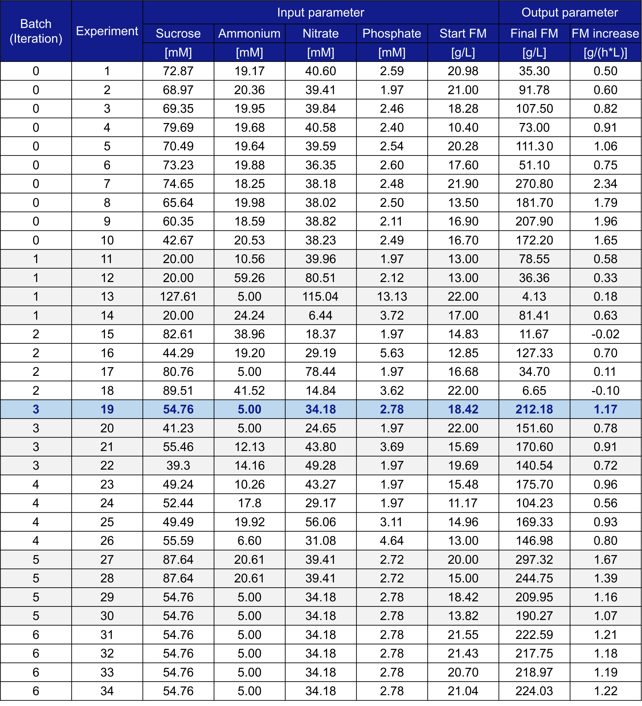

# biodapt | Bayesian experimental design for the optimization of medium composition and biomass formation of tobacco BY-2 cell suspension cultures in a stirred-tank bioreactor  

## 1. Motivation
Utilizing multi-variate, multi-objective, and batch Bayesian Experimental Design for optimizing medium composition and biomass formation in the batch-phase of tobacco BY-2 cell suspension cultures in a stirred-tank bioreactor. This repository contains the code for configuring and conducting experiments to optimize biomass formation by utilizing Bayesian Experimental Design. The following visualizations describe 1) the cultivation process, 2) the process scheme comprising parameters and objectives considered in optimization, and tabular overviews of both 3) input parameters and 4) objectives.

#### Typical cultivation process of BY-2 cells consisting of an initial one-week batch phase followed by a multi-week semi-continuous phase

<p align="center">
    
</p>

#### Process scheme with input parameters (independent variables) and objectives (dependent variables) for the biomass formation in a batch fermentation process of BY-2 cells.

<p align="center">
    
</p>

#### Overview of controllable parameters (design space) for biomass formation in a batch fermentation process of BY-2 cells

<p align="center">
    
</p>

#### Overview of objectives (objective space) for biomass formation in a batch fermentation process of BY-2 cells

<p align="center">
    
</p>

## 2. Installation Instructions

### Requirements (Please ensure to install in proposed order)

- **Python 3.12** or newer 
- **Torch** torch==2.4.1
- **BoTorch** botorch==0.12.0
- **Ax** ax-platform==0.4.3
- **Numpy** numpy==1.26.4
- **Pandas** pandas==2.2.2

### Steps

```bash
# Clone the repository
git clone <repository‑url>
cd <repository‑directory>

# Create and activate a virtual environment
python3.12 -m venv .venv
source .venv/bin/activate

# Install dependencies
pip install -r requirements.txt
```

## 3. Usage Instructions

- Define batch-size in `.main.py`
- Configure parameters and objectives in `.config/config.json`
- Provide historical experimental data in `.data/data.csv`

```bash
python main.py
```

The script outputs a JSON array with the recommended experiments for conducting the next trials and saves them in `.outputs/next_experiments.json`.

## 4. Paper Reference

Bayesian experimental design for optimizing medium composition and biomass formation of tobacco BY-2 cell suspension cultures in stirred-tank bioreactors (currently under review)

```bash
@article{Leyendecker.2025,
 author = {Leyendecker, Lars and Nausch, Henrik and Wergers, Christian and Scheffler, Dirk and Schmitt, Robert H.},
 year = {2025},
 title = {Bayesian experimental design for optimizing medium composition and biomass formation of tobacco BY-2 cell suspension cultures in stirred-tank bioreactors}
}
```

## 5. Data

The experimental data containing 34 experiments is stored in `.data/data.csv`

#### Overview of experimental data used and acquired in this study
<p align="center">
    
</p>

## 6. License

Released under the **MIT License**.  
See the `LICENSE` file for full terms.